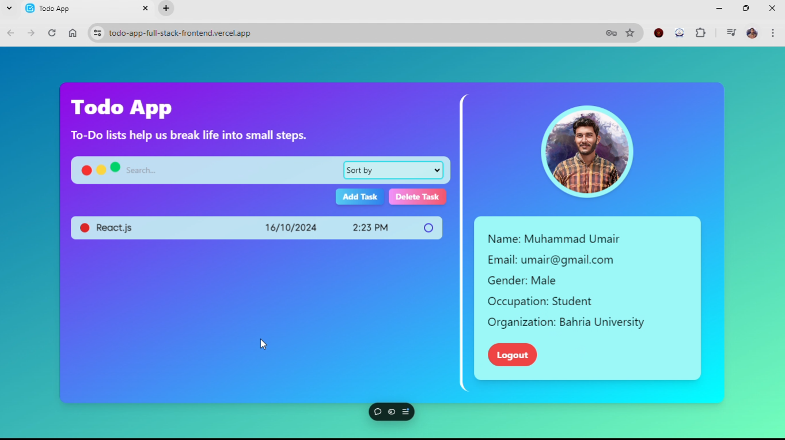

# Todo List Application

A simple Todo List application built with React.js for the frontend and Node.js with Express and MongoDB for the backend.

## Features

-   Add, view, delete tasks
-   Sort tasks by name or time
-   Search tasks by keywords
-   Responsive design

## Technologies Used

-   **Frontend**: React.js, Vite
-   **Backend**: Node.js, Express, MongoDB

## Demo

You can view the live demo of the application here:

[Live Demo](https://todo-app-full-stack-frontend.vercel.app/)

## Demo Video

<video width="600" height="350" controls>
  <source src="https://vimeo.com/1020121778" type="video/mp4">
  Your browser does not support the video tag.
</video>

<!-- [Watch the video on Vimeo](https://vimeo.com/1020121778) -->

## Getting Started

## Register


## Log-in


## Profile



### Prerequisites

-   Node.js (v12 or higher)
-   MongoDB (local installation or cloud service)

### Installation

1. Clone the repository:
    ```bash
    git clone https://github.com/yourusername/todo-app.git
    ```

## Running the Project

To run the Todo List application, follow these steps:

### 1. Start the Frontend

1. **Open your terminal.**
2. **Navigate to the client directory**:
    ```bash
    cd path/to/todo-app/client
    ```
3. Run the comamnd
    ```bash
    npm run dev
    ```

### 2. Start the Backend Server

1. **Open your terminal.**
2. **Navigate to the server directory**:
    ```bash
    cd path/to/todo-app/server/routes/index.js
    ```
3. Run the comamnd
    ```bash
    node index.js
    ```
